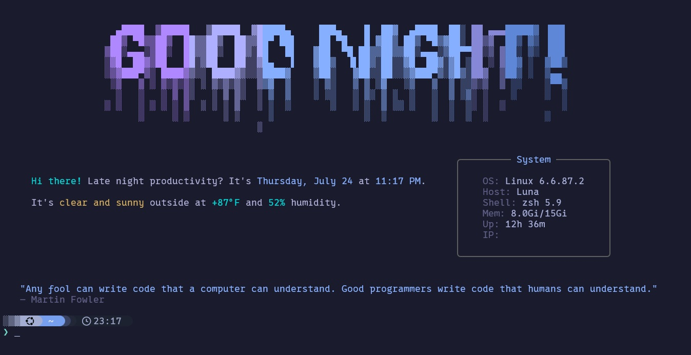

# Hello ZSH 🌃

A beautiful terminal welcome banner for ZSH with Tokyo Night theme support, ASCII art headers, and system information display.




## Features

- 🎨 **Customizable ASCII Art Headers** - Multiple font options with gradient support
- 🌃 **Tokyo Night Theme** - Beautiful dark theme with customizable colors
- 📊 **System Information** - CPU, RAM, disk usage, and uptime display
- 🌤️ **Weather Integration** - Current weather conditions for your location
- 💡 **Inspirational Quotes** - Random quotes from hacker-quotes
- 📱 **Responsive Design** - Adapts to terminal width automatically

## Installation

### Method 1: Using Zinit (Recommended)

```bash
# Install with Zinit
zinit light YOUR_USERNAME/hello-zsh

# Dependencies still need to be installed manually:
pip3 install --user rich rich-gradient pyfiglet requests psutil
```

To disable auto-run on startup:
```bash
# Add before zinit light command
export HELLO_ZSH_AUTO=false
```

### Method 2: Using install.sh

1. Clone and install:
```bash
git clone https://github.com/YOUR_USERNAME/hello-zsh.git
cd hello-zsh
./install.sh
```

2. Follow the prompts to set your name and install dependencies.

3. Add to your `.zshrc`:
```bash
# Hello-zsh welcome banner
hello-zsh
```

## Configuration

Configuration file is located at `~/.config/hello-zsh/config.toml`:

```toml
# User settings
user_name = "Wils"      # Your name for the greeting
show_weather = true     # Enable/disable weather
show_quote = true       # Enable/disable quotes

# Theme selection
theme = "tokyo-night"   # or "tokyo-night-storm"

# ASCII fonts (randomly selected)
ascii_fonts = [
    "slant", "graffiti", "bloody", "larry3d",
    "colossal", "shadow", "chunky"
]
```

### Available Themes

- **tokyo-night**: Default dark theme with vibrant colors
- **tokyo-storm**: Darker variant with muted tones

### ASCII Font Options

Popular fonts include:
- `slant` - Clean and readable
- `graffiti` - Street art style
- `bloody` - Horror themed
- `doom` - Classic gaming style
- `larry3d` - 3D effect

Run `pyfiglet -l` to see all available fonts.

## Customization

### Adding Custom Themes

Add your theme to `config.toml`:

```toml
[themes.my-theme]
red = '#ff0000'
orange = '#ff8800'
yellow = '#ffff00'
green = '#00ff00'
blue = '#0088ff'
purple = '#8800ff'
cyan = '#00ffff'
fg = '#ffffff'
bg = '#000000'
selection = '#444444'
comment = '#888888'
```

### Weather Location

The banner auto-detects your location. To set manually:

```python
# In hello-zsh.py, modify the weather URL:
weather_url = "https://wttr.in/YourCity?format=%C+%t"
```

## Screenshots

<details>
<summary>Tokyo Night Theme</summary>

```
     _   _      _ _         _____  _____ _   _ 
    | | | |    | | |       |__  / / ____| | | |
    | |_| | ___| | | ___      / / | (___ | |_| |
    |  _  |/ _ \ | |/ _ \    / /   \___ \|  _  |
    | | | |  __/ | | (_) |  / /__  ____) | | | |
    |_| |_|\___|_|_|\___/  /_____|_____/|_| |_|

    Welcome back, Wils!                    System Information
    Tuesday, July 23, 2024                ├─ OS: Linux
    Berkeley, CA: ☀️  75°F                ├─ CPU: 45%
                                          ├─ RAM: 8.2/16.0 GB
    "Talk is cheap.                       ├─ Disk: 125.4/512.0 GB
    Show me the code."                    └─ Uptime: 2d 14h 35m
    - Linus Torvalds
```

</details>

## Troubleshooting

### Unicode/Emoji Issues

If borders appear misaligned, ensure your terminal supports Unicode properly. The banner avoids emoji characters by default for better compatibility.

### Terminal Width Detection

The banner auto-detects terminal width. If text appears wrapped incorrectly, try:

```bash
export COLUMNS=$(tput cols)
```

### Performance

For faster startup, run with optimization:

```bash
python3 -O ~/.config/hello-zsh/hello-zsh.py
```

## Contributing

Contributions are welcome! Please feel free to submit a Pull Request.

## License

MIT License - see LICENSE file for details.

## Acknowledgments

- [Rich](https://github.com/Textualize/rich) - Beautiful terminal formatting
- [PyFiglet](https://github.com/pwaller/pyfiglet) - ASCII art generation
- [Tokyo Night](https://github.com/enkia/tokyo-night-vscode-theme) - Color scheme inspiration